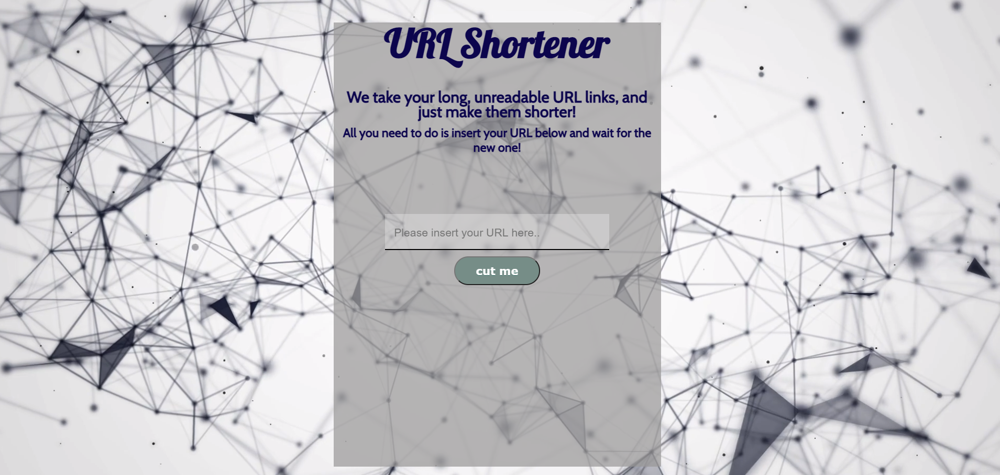

# URL shortner 📎

This project takes every-size URL and make it shorter.

[You can check it out here](https://url-shorter.ofirdanan.repl.co/)

## So, what we have here

- The site work with JSONBIN.io as online DataBase.

- The site can display the statistics on the same page **and** on the uniq URL (`api/statistic/:shorturl-id`) with the spacial ID

- The tests test the site's end points including error responses
